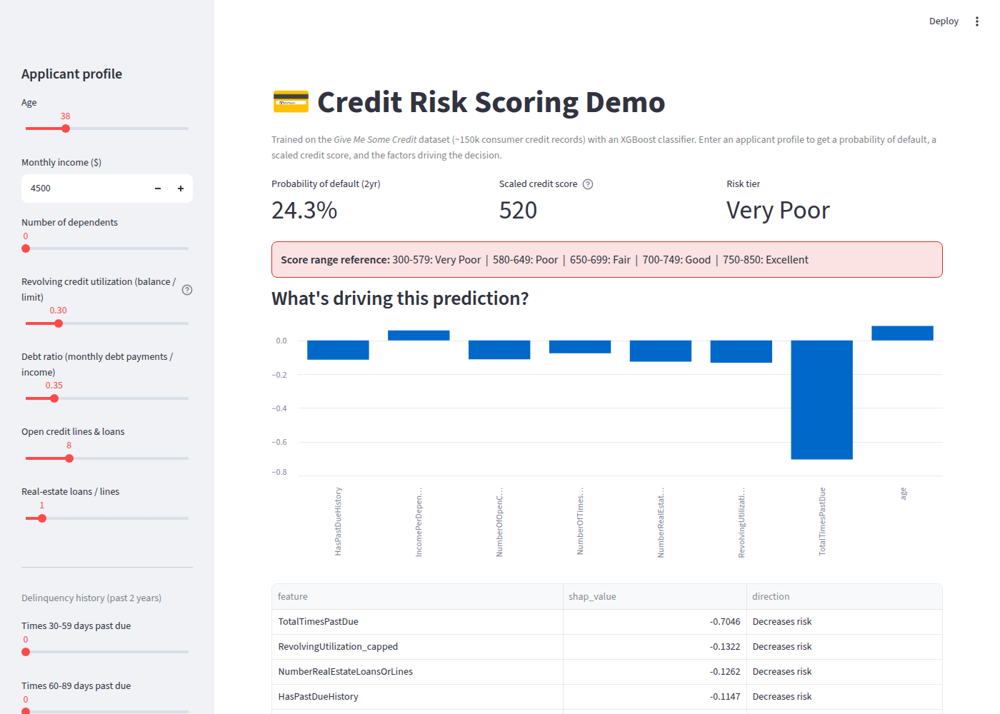
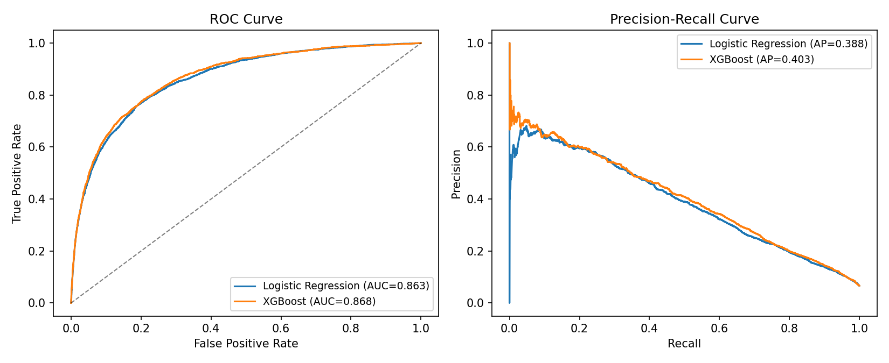
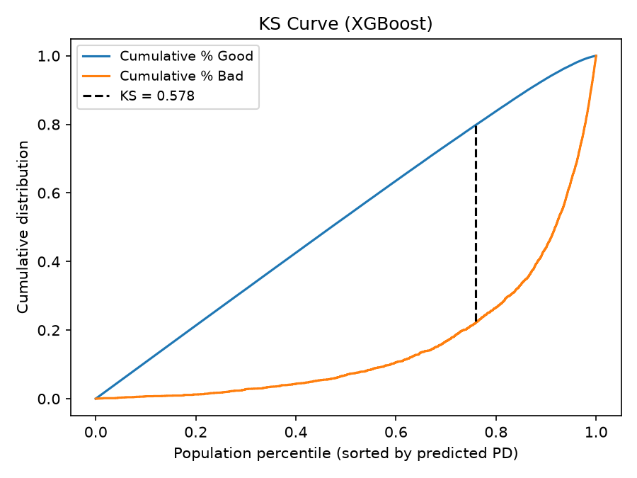
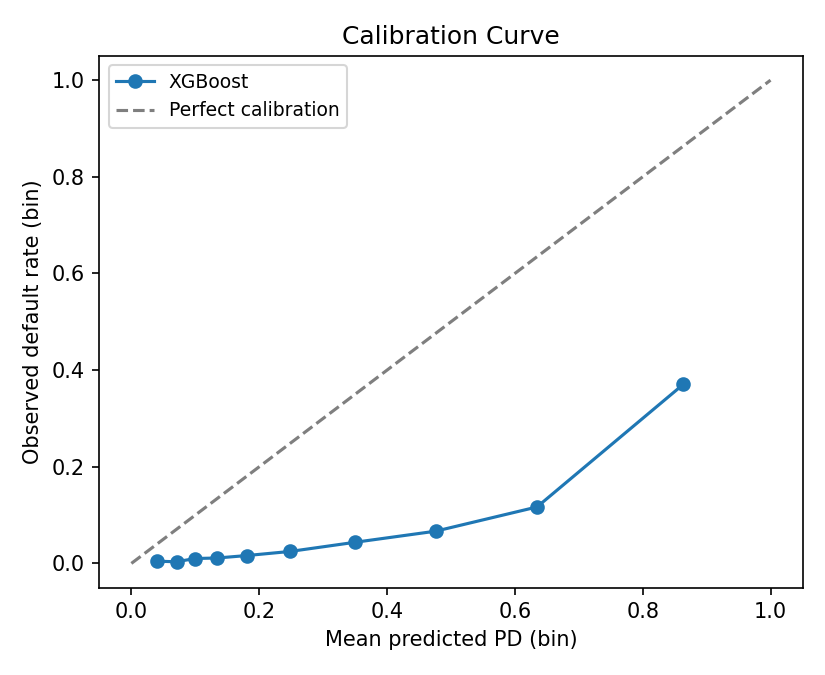
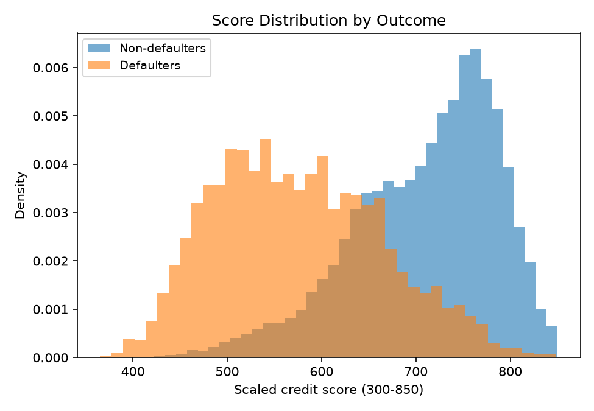
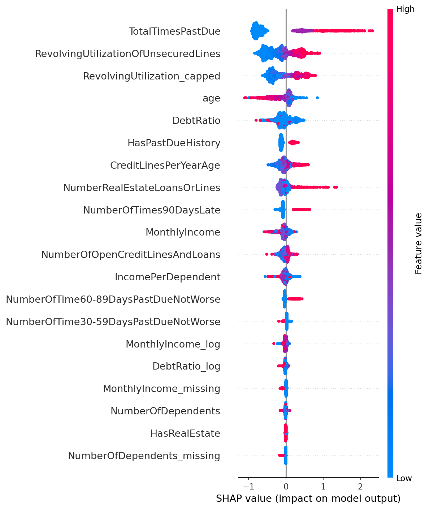
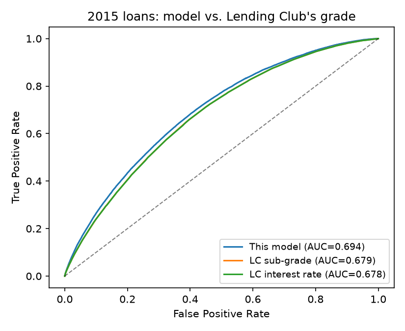
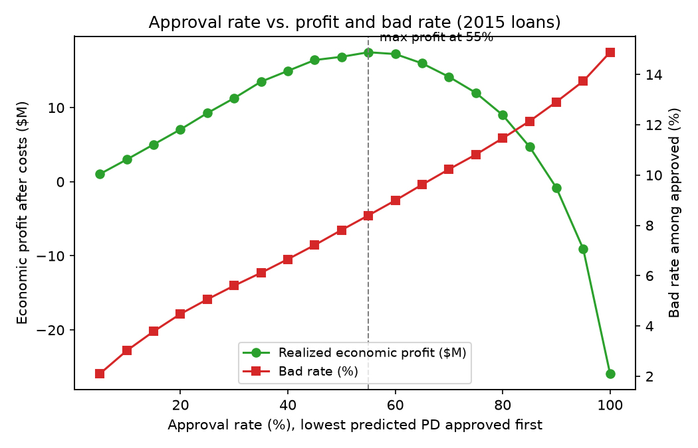
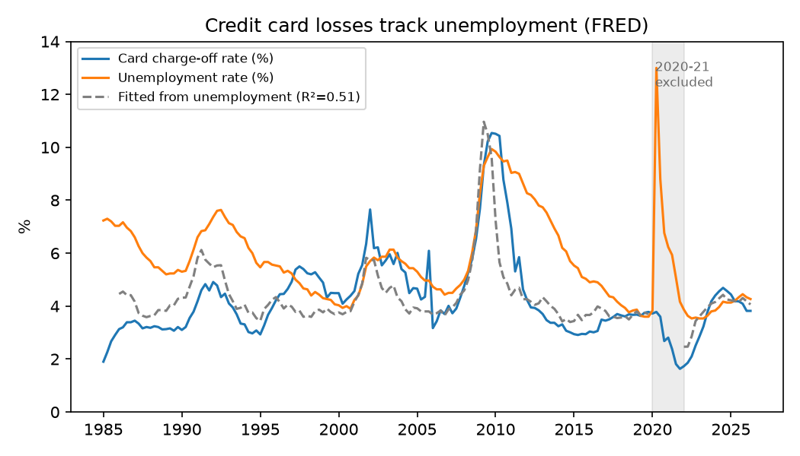

# Credit Risk Scoring

End-to-end consumer credit risk modeling on two public datasets:

1. **Give Me Some Credit** (150k borrowers): a probability-of-default model,
   a 300-850 scaled score, and SHAP-based reason codes, served through a
   Streamlit app and a REST API.
2. **Lending Club** (1M+ resolved loans, 2007-2015): an out-of-time PD model
   benchmarked against Lending Club's own grades, plus the business layer on
   top of it: expected loss, profit-based approval cutoffs, a macro stress
   test built on FRED data, and drift monitoring.


**[Run it locally](#running-it)** | **[Notebook](notebooks/01_eda_and_modeling.ipynb)**



## The business problem

Every consumer lender, whether a card issuer, a personal-loan platform or a
buy-now-pay-later company, has to answer the same question for each
applicant: how likely is this person to default, and what should that mean
for the decision? Underwriting, credit-line management and collections all
come back to that probability. This project goes from raw bureau-style data
to a calibrated probability, a score an underwriter can read, a reason for
every decision, and finally dollars: which loans to approve and how the book
holds up in a recession.

## Part 1: Give Me Some Credit scorecard

### Data

[Give Me Some Credit](https://www.kaggle.com/c/GiveMeSomeCredit) (Kaggle),
~150,000 anonymized U.S. consumer credit records. Target: serious
delinquency (90+ days past due) within two years. Base rate: **6.7%**.

The raw data has the problems real credit data has: ~20% missing income,
error codes (96/98) in the delinquency counts, and utilization and debt
ratios in the thousands where they should be roughly 0-2. All of it is
handled explicitly in [`src/data_prep.py`](src/data_prep.py). Caps and
imputation values are learned on the training split only and saved with the
model, so the app and API clean a single applicant exactly the way training
data was cleaned.

### Approach

- **Two models:** a logistic regression (the auditable baseline) against
  XGBoost. Neither uses class reweighting. Reweighting doesn't improve
  ranking and it inflates every predicted PD, which would break the score
  scale and any expected-loss math, so the models are trained on plain log
  loss and stay calibrated.
- **Scorecard scaling** ([`src/scorecard.py`](src/scorecard.py)): PD is
  mapped to a 300-850 score with the points-to-double-the-odds transform used
  by commercial scorecards (720 points at 50:1 odds, 40 points to double the
  odds).
- **Reason codes** ([`src/predict.py`](src/predict.py)): the top SHAP factors
  that raised an applicant's risk, worded the way an adverse action notice
  under ECOA / Regulation B would list them. A reason is only given when it
  is material and actually true of the applicant (the model can't blame
  "late payments" on someone who has none).

### Results

Held-out 25% test split (37,500 borrowers):

| Model | ROC-AUC | PR-AUC | KS | Gini | Brier | Mean PD vs. actual |
|---|---|---|---|---|---|---|
| Logistic regression | 0.861 | 0.386 | 0.564 | 0.722 | 0.0498 | 6.65% vs. 6.68% |
| **XGBoost** | **0.869** | **0.408** | **0.578** | **0.739** | **0.0486** | 6.67% vs. 6.68% |

A KS above 0.4 is usually considered good separation in credit risk, and
above 0.5 very good. **The riskiest 10% of applicants by predicted PD
account for 56% of all defaults** in the test set, which is what matters
for a "manually review the top N%" workflow.

| ROC / PR curves | KS curve | Calibration |
|---|---|---|
|  |  |  |



SHAP shows the model relying on the signals a credit analyst would expect:
prior delinquency and revolving utilization first, then age and debt ratio.



## Part 2: Lending Club, from PD to dollars

### Data

- **Lending Club accepted loans, 2007-2018** (2.26M loans, CC0), including
  each loan's price, payments and recoveries, which is what makes loss and
  profit measurable. The project uses 36-month individual loans.
- **FRED** (St. Louis Fed): monthly unemployment for every state, national
  unemployment, and the credit card charge-off rate at U.S. commercial banks
  back to 1985.

### Design

| | Loans | Purpose |
|---|---|---|
| Train | 338k issued 2007-2014 | fit the PD model and the loss assumptions |
| Test | 283k issued 2015 | out-of-time validation, the way a lender would validate |
| Monitor | 919k issued 2016-2018 | outcomes not final yet; used for drift monitoring |

The model only sees what's known at application time: income, DTI, FICO,
credit history, utilization, inquiries, recent account openings and so on.
**Lending Club's own grade and interest rate are left out on purpose** so the
model can be benchmarked against them.

### PD model vs. Lending Club's grade

| 2015 loans | ROC-AUC | KS |
|---|---|---|
| **This model** | **0.694** | **0.282** |
| Lending Club sub-grade (A1-G5) | 0.679 | 0.263 |
| Lending Club interest rate | 0.678 | |



Two feature experiments, one kept and one dropped:

- **Trended bureau fields help a lot.** Adding recent account openings,
  bankcard utilization and months since the last inquiry took AUC from 0.676
  to 0.694, which is what moved the model past Lending Club's grade.
- **State unemployment doesn't.** I joined each borrower's state
  unemployment rate at the time of the loan from FRED. It adds nothing to AUC
  (0.6938 either way, and the pipeline reruns this ablation every time) and
  it is the most unstable input there is. Macro risk is handled by a separate
  stress overlay instead, the usual split between a through-the-cycle PD
  model and a macro overlay.

### Business layer

[`src/business.py`](src/business.py) turns PDs into dollars:

- **Expected loss = PD x LGD x EAD**, with LGD (89%), EAD (58% of the funded
  amount) and prepayment (paid-off loans deliver 82% of scheduled interest)
  all estimated from the 2007-2014 loans.
- **Economic profit**: realized cash flows minus Lending Club's 1% servicing
  fee and a 4% per year funding cost. Without costs almost every loan looks
  profitable and there is no real decision to make.

Realized results on the 2015 book:

| Strategy | Approved | Bad rate | Economic profit |
|---|---|---|---|
| Approve everything | 100% | 14.9% | -$25.9M |
| Lending Club grades A-C only | 84.5% | 12.4% | -$7.4M |
| This model, same volume as A-C | 84.5% | 12.1% | **+$5.1M** |
| This model, approve if expected profit > 0 | 55.0% | 14.4% | **+$11.8M** |

At the same approval volume, ranking by this model instead of Lending
Club's grade turns a $7.4M loss into a $5.1M profit. The expected-profit
rule decides before any outcomes are known, and it finds something a pure
risk cutoff doesn't: its bad rate is barely lower than approving everyone,
because it keeps higher-risk loans whose interest rate more than pays for
the risk. That's risk-based pricing showing up in the data.



In hindsight the best simple PD cutoff is also around 55% approval (+$17.5M,
bad rate 8.4%), but that number is chosen by looking at 2015 outcomes, so
the ex-ante rule is the fair comparison.

**What didn't hold up:** the 2015 vintage defaulted at 14.9% against 13.7%
predicted. Loans got riskier in ways the application data didn't capture, so
expected loss on the whole book came in about 10% under realized loss. The
score PSI stayed stable (below), which is exactly why lenders backtest
against actual outcomes and don't rely on input drift alone.

### Macro stress test

[`src/macro.py`](src/macro.py) fits a satellite model on 1985-2019 FRED data:

    logit(card charge-off rate) = a + b1 x unemployment + b2 x (12-month change in unemployment)

Losses respond to unemployment *rising*, not just to its level: the change
term takes R² from 0.15 to 0.51. 2020-21 is excluded because stimulus pushed
charge-offs down while unemployment spiked. Each scenario is a 12-quarter
unemployment path over the life of the loan, shaped like the Fed's
supervisory scenarios, and every loan's PD is shifted by the implied change
in log-odds.



For the book approved by the expected-profit rule:

| Scenario | Peak unemployment | Mean PD | Expected loss | Loss rate | Expected profit |
|---|---|---|---|---|---|
| Baseline | 4.3% | 11.5% | $113M | 5.7% | +$62M |
| Mild recession | 6.3% | 13.6% | $133M | 6.7% | +$41M |
| Severe recession | 10.0% | 18.8% | $185M | 9.3% | -$13M |

The severe scenario roughly doubles PDs, in line with Lending Club's own
2007-2008 vintages (21-26% default rates vs. 11% for 2011). The main
simplification is that the satellite model is fit on bank card charge-offs,
so it assumes Lending Club borrowers respond to the cycle in the same
proportion as card borrowers.

### Drift monitoring

[`src/monitoring.py`](src/monitoring.py) computes the Population Stability
Index for the score and every feature, with 2016-2018 applications compared
to the 2014 vintage. The score is stable (PSI 0.016). Bankcard and revolving
utilization show moderate shifts (0.11-0.13); everything else is stable.
The full table is in [`reports/lending_club/psi.csv`](reports/lending_club/psi.csv).

## Running it

```bash
git clone https://github.com/jlwj22/Fintech-Credit-Risk-Modeling.git
cd Fintech-Credit-Risk-Modeling
python -m venv .venv && source .venv/bin/activate
pip install -r requirements-dev.txt
```

The trained models and summary tables are committed, so the app, the API and
the tests work straight after cloning:

```bash
streamlit run app.py        # scoring demo + Lending Club portfolio page
uvicorn src.api:app         # REST API, docs at http://localhost:8000/docs
pytest                      # 41 tests
```

To rebuild everything from raw data:

```bash
python -m src.download_data   # Kaggle (needs the Kaggle CLI), Lending Club (~1.7 GB), FRED
python -m src.train           # Give Me Some Credit models and figures
python -m src.lc_data         # Lending Club features + FRED join
python -m src.lc_train        # PD model, business layer, stress test, drift
```

The `Makefile` wraps all of these (`make data`, `make train`, `make train-lc`,
`make test`, ...).

### API

```bash
curl -X POST localhost:8000/score -H 'Content-Type: application/json' -d '{
  "revolving_utilization": 0.85, "age": 29, "debt_ratio": 0.45,
  "monthly_income": 3800, "open_credit_lines": 6, "times_30_59_days_late": 2
}'
```

```json
{"probability_of_default": 0.2303, "score": 564, "tier": "Very Poor",
 "reasons": ["Number of late payments", "High balances relative to credit limits",
             "History of late payments", "Length of credit profile (age)"]}
```

Or with Docker: `docker build -t credit-risk-api . && docker run -p 8000:8000 credit-risk-api`.

## Project structure

```
├── app.py                        # Streamlit scoring demo
├── pages/
│   └── 1_Lending_Club_Portfolio.py  # cutoffs, strategies, stress scenario, drift
├── src/
│   ├── data_prep.py              # GMSC cleaning + features (fit on train, applied everywhere)
│   ├── train.py                  # GMSC models, metrics, figures
│   ├── scorecard.py              # PD -> 300-850 score -> tier
│   ├── predict.py                # single-applicant scoring + reason codes
│   ├── api.py                    # FastAPI service
│   ├── download_data.py          # Kaggle, Lending Club, FRED
│   ├── lc_data.py                # Lending Club features + state unemployment join
│   ├── lc_train.py               # LC model, benchmark, business layer, stress, drift
│   ├── business.py               # expected loss, expected profit, cutoff tables
│   ├── macro.py                  # FRED satellite model + recession scenarios
│   └── monitoring.py             # Population Stability Index
├── notebooks/01_eda_and_modeling.ipynb
├── models/                       # trained models + metrics
├── reports/figures/              # all charts
├── reports/lending_club/         # summary tables behind the portfolio page
├── tests/
├── Dockerfile
└── .github/workflows/ci.yml      # ruff + pytest on 3.11 and 3.12
```

## Limitations

This is a portfolio project on public data, not a production underwriting
system. A real deployment would also need fair lending testing across
protected classes, reject inference (both datasets only contain approved
borrowers, so the models never see the people who were turned down),
recalibration on recent vintages, and model risk management sign-off. The
cost assumptions in the business layer are simple and set in one place
(`CostAssumptions` in `src/business.py`) so they're easy to change.

## License

Code is MIT, see [LICENSE](LICENSE). Give Me Some Credit is used under its
Kaggle competition terms and isn't redistributed here. Lending Club data is
CC0. The FRED series used come from the BLS and the Federal Reserve and are
public domain.
